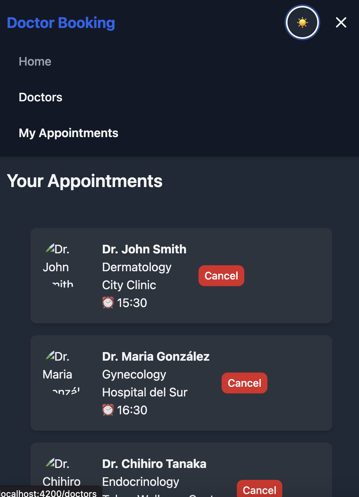
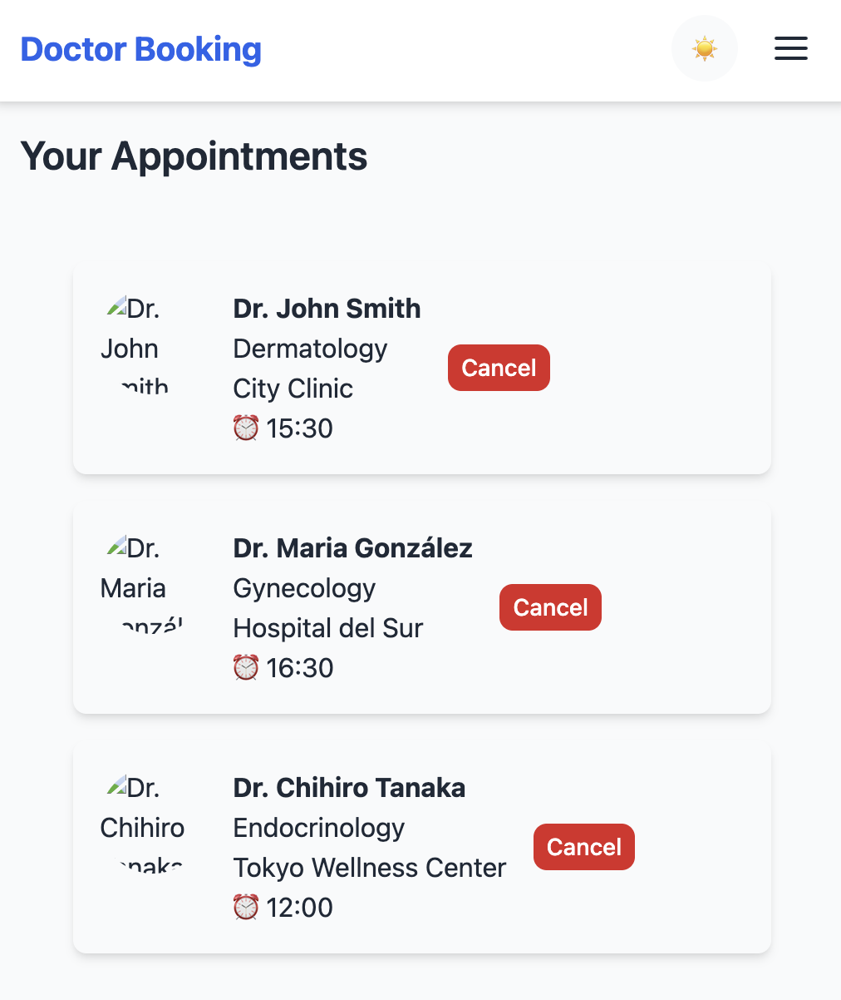

# 🏥 DoctorBookingApp

A fully responsive and accessible front-end UI for booking doctor appointments, built with React, TailwindCSS, Zustand and Nx. All data is mocked—no backend required.

## Repository
The project is on the next [github link](https://github.com/RexVG-Dev/doctor-booking-app)

---

## 🎯 Objective

Design and build a fully responsive and accessible appointment-booking UI for a healthcare platform. Focus areas:

- Layout & interaction
- Accessibility (keyboard nav, ARIA, responsive)
- Code quality & organisation
- Pure front-end (mock data, no backend)

AI tools (Cursor, Copilot, ChatGPT) were leveraged to accelerate scaffolding, test generation and accessibility improvements.

---

## 📝 Features

### 1. Doctor Directory View

- **Mock list of doctors** with name, photo, specialty, rating, availability and location
- **Filter** by specialty and availability
- **“Book Appointment”** button on each doctor card

### 2. Booking Modal

- Opens on “Book Appointment” click
- Displays doctor name and mocked time slots
- Allows selecting one slot and confirming

### 3. Appointments Summary View

- Tab/section listing all confirmed appointments
- Shows doctor name, date/time, specialty and location

---

## 🧱 Architecture

- **Monorepo** managed with [Nx](https://nx.dev/)
- **App shell** (`doctor-booking-app`): routes, layout, global providers
- **Components**: `DoctorCard`, `FilterBar`, `BookingModal`, `AppointmentList`, etc.
- **State**: global store with [Zustand](https://github.com/pmndrs/zustand)
- **Styling**: utility-first with [TailwindCSS](https://tailwindcss.com/)
- **Mock Data**: static JSON for doctors and appointments

---

## 🚀 Setup & Commands

1. **Clone repo**

   ```bash
   git clone https://github.com/RexVG-Dev/doctor-booking-app.git
   cd doctor-booking-app
   npm install
   ```

2. **Run development server**

   ```bash
   npx nx serve doctor-booking-app
   ```

3. **Build for production**

   ```bash
   npx nx build doctor-booking-app
   ```

4. **List available targets**

   ```bash
   npx nx show project doctor-booking-app
   ```

---

## 🔍 Accessibility

- **Keyboard navigation**: all interactive elements reachable via Tab/Enter/Esc
- **ARIA**: `aria-label`, `role` and `aria-describedby` used appropriately
- **Semantic HTML**: `<main>`, `<section>`, `<button>`, etc.
- **Responsive**: mobile → tablet → desktop layouts
- **Audited** with Lighthouse & axe DevTools to ensure basic WCAG conformance

---

## 🧪 Testing Strategy
- **Unit & integration tests** implemented with Jest and React Testing Library for key components (DoctorCard, BookingModal, AppointmentList).
- **Future:** complete the test suite to cover error scenarios, accessibility tests using jest-axe, and increase coverage of the Zustand store.
- Although critical functionalities were covered (filtering, modal opening, and appointment confirmation), some tests for edge cases and accessibility validations were missing.
---

## ⚠️ Known Limitations

- No data persistence—app state resets on refresh
- Mocked time slots and doctors only
- No form validations or error messages
- No authentication or user profiles
- Fixed filters (specialty & availability) only

---

## 🤖 Use of AI Tools

- **Cursor** for component scaffolding and Tailwind snippets
- **GitHub Copilot** for code autocompletion
- **ChatGPT** for README drafting, accessibility suggestions and mock data generation

---

## 📸 Screenshots
 





---
